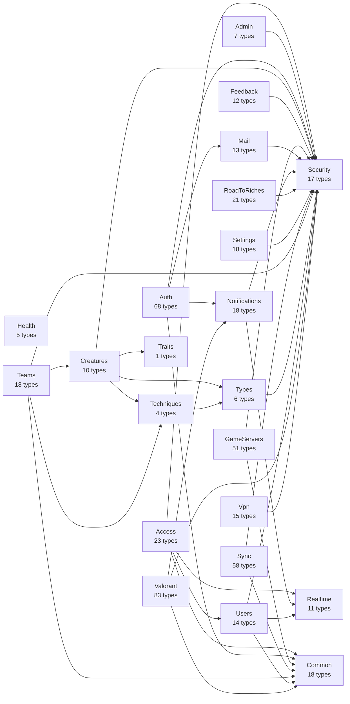

# Dépendances entre sous-modules

> Boîte arrondie = port (interface). Trait plein = dépend de. Trait pointillé = implémente.

```mermaid
flowchart LR
  Access["Access<br/>23 types"]
  Admin["Admin<br/>7 types"]
  Auth["Auth<br/>68 types"]
  Common["Common<br/>18 types"]
  Creatures["Creatures<br/>10 types"]
  Feedback["Feedback<br/>12 types"]
  GameServers["GameServers<br/>51 types"]
  Health["Health<br/>5 types"]
  Mail["Mail<br/>13 types"]
  Notifications["Notifications<br/>18 types"]
  Realtime["Realtime<br/>11 types"]
  RoadToRiches["RoadToRiches<br/>21 types"]
  Security["Security<br/>17 types"]
  Settings["Settings<br/>18 types"]
  Sync["Sync<br/>58 types"]
  Teams["Teams<br/>18 types"]
  Techniques["Techniques<br/>4 types"]
  Traits["Traits<br/>1 types"]
  Types["Types<br/>6 types"]
  Users["Users<br/>14 types"]
  Valorant["Valorant<br/>83 types"]
  Vpn["Vpn<br/>15 types"]
  Access --> Common
  Access --> Realtime
  Access --> Security
  Access --> Users
  Admin --> Security
  Auth --> Common
  Auth --> Mail
  Auth --> Notifications
  Auth --> Security
  Creatures --> Security
  Creatures --> Techniques
  Creatures --> Traits
  Creatures --> Types
  Feedback --> Security
  GameServers --> Common
  GameServers --> Security
  Mail --> Security
  Notifications --> Realtime
  Notifications --> Security
  RoadToRiches --> Security
  Settings --> Security
  Sync --> Common
  Sync --> Security
  Teams --> Common
  Teams --> Creatures
  Teams --> Security
  Teams --> Techniques
  Techniques --> Types
  Types --> Security
  Users --> Common
  Users --> Realtime
  Users --> Security
  Valorant --> Common
  Valorant --> Notifications
  Valorant --> Security
  Vpn --> Security
```
