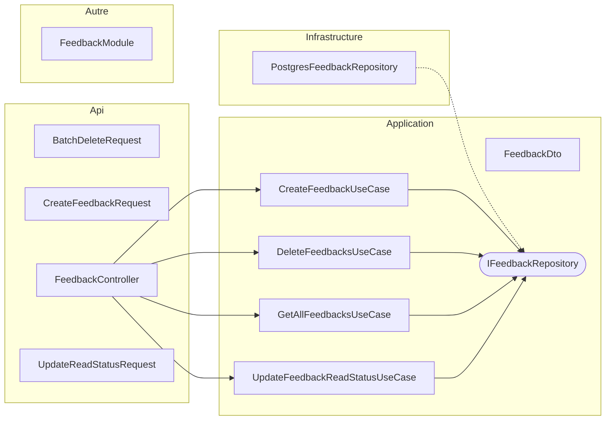

# Core / Feedback

> Boîte arrondie = port (interface). Trait plein = dépend de. Trait pointillé = implémente.

```mermaid
flowchart LR
  subgraph Api
  BatchDeleteRequest["BatchDeleteRequest"]
  CreateFeedbackRequest["CreateFeedbackRequest"]
  FeedbackController["FeedbackController"]
  UpdateReadStatusRequest["UpdateReadStatusRequest"]
  end
  subgraph Application
  CreateFeedbackUseCase["CreateFeedbackUseCase"]
  DeleteFeedbacksUseCase["DeleteFeedbacksUseCase"]
  FeedbackDto["FeedbackDto"]
  GetAllFeedbacksUseCase["GetAllFeedbacksUseCase"]
  IFeedbackRepository(["IFeedbackRepository"])
  UpdateFeedbackReadStatusUseCase["UpdateFeedbackReadStatusUseCase"]
  end
  subgraph Infrastructure
  PostgresFeedbackRepository["PostgresFeedbackRepository"]
  end
  subgraph Autre
  FeedbackModule["FeedbackModule"]
  end
  CreateFeedbackUseCase --> IFeedbackRepository
  DeleteFeedbacksUseCase --> IFeedbackRepository
  FeedbackController --> CreateFeedbackUseCase
  FeedbackController --> DeleteFeedbacksUseCase
  FeedbackController --> GetAllFeedbacksUseCase
  FeedbackController --> UpdateFeedbackReadStatusUseCase
  GetAllFeedbacksUseCase --> IFeedbackRepository
  PostgresFeedbackRepository -.-> IFeedbackRepository
  UpdateFeedbackReadStatusUseCase --> IFeedbackRepository
```
